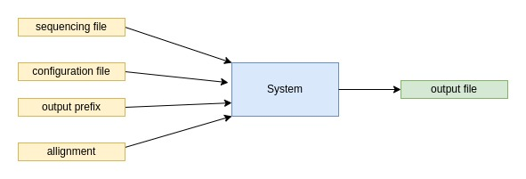
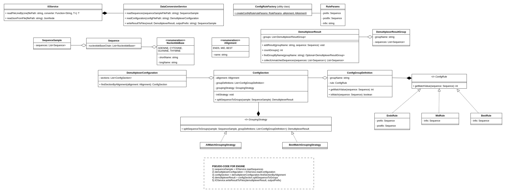

# Simplified Sequencing Data Demultiplexer

This project implements a simplified sequencing data demultiplexer, a command-line tool designed to process DNA sequences 
and categorize them into groups based on user-defined configurations. It is implemented in Java 23 with a strong focus on clean, 
production-ready code, and thorough unit test coverage.

## Architecture

A simplified scheme of the main functionality is displayed in the following image:



A detailed UML-diagram of the component of the application:



## Features

* DNA Sequence Demultiplexing: Splits DNA sequences into predefined groups based on alignment rules.
* Configurable Alignments:
  * endsAlignment: Matches sequences by prefix and postfix.
  * midAlignment: Matches sequences by an infix.
  * bestAlignment: Finds sequences that match the most with a provided infix.
* Unmatched Sequences Handling: Sequences that do not fit into any group are placed in an unmatched group.
* Customizable Configuration: The configuration file specifies group names and alignment rules.

## Input Files

* Sequencing Data File: Text file with one DNA sequence per line.
* Configuration File: Defines group names, prefixes, postfixes, and infixes for alignment.
* Output Path Prefix: Base path for the generated output files.

## Outputs

The tool generates grouped sequence files (group1.seq, group2.seq, etc.) 
and an unmatched.seq file for unmatched sequences.

## Example

### Input Files

sequence.seq

```
ACTCACGACCACTAACTAGCAATACGATCG
CAGTAAGCGATCAGACAGTACAGACGTACA
ACTCACGACCACTAACTGGCAATACGATCG
AGACAACATCAGATCGCAAGACGACAGATA
```

config.conf

```
{
    "endsAlignment": {
        "group1": { "prefix": "ACTCACG", "postfix": "ACGATCG" },
        "group2": { "prefix": "CAGTAAG", "postfix": "ACGTACA" }
    },
    "midAlignment": {
        "group1": { "infix": "CACTAACT" },
        "group2": { "infix": "CAGACAGT" }
    },
    "bestAlignment": {
        "group1": { "infix": "CTATCTAGCAAT" }
    }
}
```

### Output example

group1.seq:
```
ACTCACGACCACTAACTAGCAATACGATCG
ACTCACGACCACTAACTGGCAATACGATCG
```

group2.seq:
```
CAGTAAGCGATCAGACAGTACAGACGTACA
```

unmatched.seq:
```
AGACAACATCAGATCGCAAGACGACAGATA
```

## Technical Aspects

* Environment
* Java: Java 23
* Build System: Maven
* Containerization: Docker
* Key Libraries
* Logging: Log4j (v1.2.17)
* Object Mapping: Jackson (v2.15.2)
* Utilities: Lombok (v1.18.30)
* Testing: JUnit 5, Mockito
* Deployment, containerization
  * The project can be packaged as an executable JAR and run manually within a Docker container.
  * The Docker image includes the JAR but does not execute it by default. You can run the JAR after opening a shell in the container:

## How to run

The CLI-application can easily be run in a containerized environment using the provided Dockerfile.
The following steps are needed:

1) Build project with maven:

```
mvn clean package
```

2) Build docker image:

```
docker build -t demultiplexer .
```

3) Verify container is running:

```
docker ps
```

4) Open a shell in the container (if not presented with one already): 

```
docker exec -it <container_id> sh
```

5) Check java version in container (output should signal java 23 running):

```
java --version
```

6) Move some data to the filesystem of the container for testing purposes:

```
docker cp example_1 3356c37051a5:/app
```

7) Execute the JAR file with the required command-line arguments: 

```
java -jar demultiplexer.jar /app/example_1/sequence.seq /app/example_1/config.conf /app/output/result_ endsAlignment
```

Sidenote: the hard-coded JAR-filename should be removed from the Dockerfile to enable proper versioning.